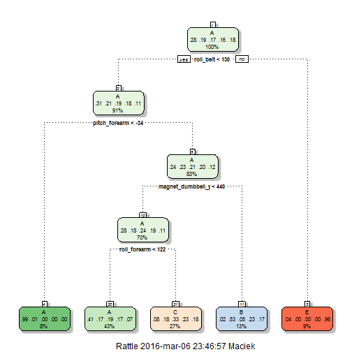

#Course Project - Machine Learning

Author: 

##Introduction

The subject of thi report is the analysis of the output from activity measuring devices - data contains 160 variables - measurements taken from 6 participants. The aim of the report to predict the manner in which they did the exercise included in the "classe" variable. "clasee" variable contains qualitative measure of the quality of performance of the exercise. It could be performed in five different fashions: exactly according to the specification (Class A), throwing the elbows to the front (Class B), lifting the dumbbell only halfway (Class C), lowering the dumbbell only halfway (Class D) and throwing the hips to the front (Class E) (information on the basis of http://groupware.les.inf.puc-rio.br/har). Report includes three different parts - reading and preprocessing data, exploratory data analysis and building machine learning algorithm.

##Reading and pre-processing data

Below code reads data.


```r
setwd("C:/Users/Maciek/Desktop/Coursera/MachLear/CourseProject")
train<-read.csv('pml-training.csv')
test<-read.csv('pml-testing.csv')
```

Taking into account that number of variables is very large, we start with analysing whether there are any variables which contain only or mostly NAs - which might be quite common with these types of measurments.


```r
#Below code calculates variables in case of which there are more than 90% of NAs
#Such variable will be dropped in further analysis

nas<-sapply(train,function(x) (sum(is.na(x))/length(x)>0.9))
drop<-names(nas[which(nas)])
train<-train[,-which(names(train) %in% drop)]
test<-test[,-which(names(test) %in% drop)]

#now we are cheking whether some of the columns might have very low variability 
#and thus be useless in further analysis
library(caret)
nzv<-nearZeroVar(train,saveMetrics=TRUE)
nzv
```

```
##                           freqRatio percentUnique zeroVar   nzv
## X                          1.000000  100.00000000   FALSE FALSE
## user_name                  1.100679    0.03057792   FALSE FALSE
## raw_timestamp_part_1       1.000000    4.26562022   FALSE FALSE
## raw_timestamp_part_2       1.000000   85.53154622   FALSE FALSE
## cvtd_timestamp             1.000668    0.10192641   FALSE FALSE
## new_window                47.330049    0.01019264   FALSE  TRUE
## num_window                 1.000000    4.37264295   FALSE FALSE
## roll_belt                  1.101904    6.77810621   FALSE FALSE
## pitch_belt                 1.036082    9.37722964   FALSE FALSE
## yaw_belt                   1.058480    9.97349913   FALSE FALSE
## total_accel_belt           1.063160    0.14779329   FALSE FALSE
## kurtosis_roll_belt      1921.600000    2.02323922   FALSE  TRUE
## kurtosis_picth_belt      600.500000    1.61553358   FALSE  TRUE
## kurtosis_yaw_belt         47.330049    0.01019264   FALSE  TRUE
## skewness_roll_belt      2135.111111    2.01304658   FALSE  TRUE
## skewness_roll_belt.1     600.500000    1.72255631   FALSE  TRUE
## skewness_yaw_belt         47.330049    0.01019264   FALSE  TRUE
## max_yaw_belt             640.533333    0.34654979   FALSE  TRUE
## min_yaw_belt             640.533333    0.34654979   FALSE  TRUE
## amplitude_yaw_belt        50.041667    0.02038528   FALSE  TRUE
## gyros_belt_x               1.058651    0.71348486   FALSE FALSE
## gyros_belt_y               1.144000    0.35164611   FALSE FALSE
## gyros_belt_z               1.066214    0.86127816   FALSE FALSE
## accel_belt_x               1.055412    0.83579655   FALSE FALSE
## accel_belt_y               1.113725    0.72877383   FALSE FALSE
## accel_belt_z               1.078767    1.52379982   FALSE FALSE
## magnet_belt_x              1.090141    1.66649679   FALSE FALSE
## magnet_belt_y              1.099688    1.51870350   FALSE FALSE
## magnet_belt_z              1.006369    2.32901845   FALSE FALSE
## roll_arm                  52.338462   13.52563449   FALSE FALSE
## pitch_arm                 87.256410   15.73234125   FALSE FALSE
## yaw_arm                   33.029126   14.65701763   FALSE FALSE
## total_accel_arm            1.024526    0.33635715   FALSE FALSE
## gyros_arm_x                1.015504    3.27693405   FALSE FALSE
## gyros_arm_y                1.454369    1.91621649   FALSE FALSE
## gyros_arm_z                1.110687    1.26388747   FALSE FALSE
## accel_arm_x                1.017341    3.95984099   FALSE FALSE
## accel_arm_y                1.140187    2.73672409   FALSE FALSE
## accel_arm_z                1.128000    4.03628580   FALSE FALSE
## magnet_arm_x               1.000000    6.82397309   FALSE FALSE
## magnet_arm_y               1.056818    4.44399144   FALSE FALSE
## magnet_arm_z               1.036364    6.44684538   FALSE FALSE
## kurtosis_roll_arm        246.358974    1.68178575   FALSE  TRUE
## kurtosis_picth_arm       240.200000    1.67159311   FALSE  TRUE
## kurtosis_yaw_arm        1746.909091    2.01304658   FALSE  TRUE
## skewness_roll_arm        249.558442    1.68688207   FALSE  TRUE
## skewness_pitch_arm       240.200000    1.67159311   FALSE  TRUE
## skewness_yaw_arm        1746.909091    2.01304658   FALSE  TRUE
## roll_dumbbell              1.022388   84.20650290   FALSE FALSE
## pitch_dumbbell             2.277372   81.74498012   FALSE FALSE
## yaw_dumbbell               1.132231   83.48282540   FALSE FALSE
## kurtosis_roll_dumbbell  3843.200000    2.02833554   FALSE  TRUE
## kurtosis_picth_dumbbell 9608.000000    2.04362450   FALSE  TRUE
## kurtosis_yaw_dumbbell     47.330049    0.01019264   FALSE  TRUE
## skewness_roll_dumbbell  4804.000000    2.04362450   FALSE  TRUE
## skewness_pitch_dumbbell 9608.000000    2.04872082   FALSE  TRUE
## skewness_yaw_dumbbell     47.330049    0.01019264   FALSE  TRUE
## max_yaw_dumbbell         960.800000    0.37203139   FALSE  TRUE
## min_yaw_dumbbell         960.800000    0.37203139   FALSE  TRUE
## amplitude_yaw_dumbbell    47.920200    0.01528896   FALSE  TRUE
## total_accel_dumbbell       1.072634    0.21914178   FALSE FALSE
## gyros_dumbbell_x           1.003268    1.22821323   FALSE FALSE
## gyros_dumbbell_y           1.264957    1.41677709   FALSE FALSE
## gyros_dumbbell_z           1.060100    1.04984201   FALSE FALSE
## accel_dumbbell_x           1.018018    2.16593619   FALSE FALSE
## accel_dumbbell_y           1.053061    2.37488533   FALSE FALSE
## accel_dumbbell_z           1.133333    2.08949139   FALSE FALSE
## magnet_dumbbell_x          1.098266    5.74864948   FALSE FALSE
## magnet_dumbbell_y          1.197740    4.30129447   FALSE FALSE
## magnet_dumbbell_z          1.020833    3.44511263   FALSE FALSE
## roll_forearm              11.589286   11.08959331   FALSE FALSE
## pitch_forearm             65.983051   14.85577413   FALSE FALSE
## yaw_forearm               15.322835   10.14677403   FALSE FALSE
## kurtosis_roll_forearm    228.761905    1.64101519   FALSE  TRUE
## kurtosis_picth_forearm   226.070588    1.64611151   FALSE  TRUE
## kurtosis_yaw_forearm      47.330049    0.01019264   FALSE  TRUE
## skewness_roll_forearm    231.518072    1.64611151   FALSE  TRUE
## skewness_pitch_forearm   226.070588    1.62572623   FALSE  TRUE
## skewness_yaw_forearm      47.330049    0.01019264   FALSE  TRUE
## max_yaw_forearm          228.761905    0.22933442   FALSE  TRUE
## min_yaw_forearm          228.761905    0.22933442   FALSE  TRUE
## amplitude_yaw_forearm     59.677019    0.01528896   FALSE  TRUE
## total_accel_forearm        1.128928    0.35674243   FALSE FALSE
## gyros_forearm_x            1.059273    1.51870350   FALSE FALSE
## gyros_forearm_y            1.036554    3.77637346   FALSE FALSE
## gyros_forearm_z            1.122917    1.56457038   FALSE FALSE
## accel_forearm_x            1.126437    4.04647844   FALSE FALSE
## accel_forearm_y            1.059406    5.11160942   FALSE FALSE
## accel_forearm_z            1.006250    2.95586586   FALSE FALSE
## magnet_forearm_x           1.012346    7.76679238   FALSE FALSE
## magnet_forearm_y           1.246914    9.54031189   FALSE FALSE
## magnet_forearm_z           1.000000    8.57710733   FALSE FALSE
## classe                     1.469581    0.02548160   FALSE FALSE
```

```r
drop2<-row.names(nzv[nzv$nzv==TRUE,])

#we are dropping also near zero variables

train<-train[,-which(names(train) %in% drop2)]
test<-test[,-which(names(test) %in% drop2)]

#we drop also X variable which is an identification variable causing problems in the course of modelling

train<-train[,-1]
test<-test[,-1]
```

Inspecting the dataset, after above transformation of data shows, that in the remaining variables (59 variables remained in the dataset) there are no NAs. Thus, there is no need to impute missing values. 

##Exploratory data analysis

After pre-processing the dataset, we will perform exploratory data analysis on the training set.


```r
#summary of data
summary(train) 
```

```
##     user_name    raw_timestamp_part_1 raw_timestamp_part_2
##  adelmo  :3892   Min.   :1.322e+09    Min.   :   294      
##  carlitos:3112   1st Qu.:1.323e+09    1st Qu.:252912      
##  charles :3536   Median :1.323e+09    Median :496380      
##  eurico  :3070   Mean   :1.323e+09    Mean   :500656      
##  jeremy  :3402   3rd Qu.:1.323e+09    3rd Qu.:751891      
##  pedro   :2610   Max.   :1.323e+09    Max.   :998801      
##                                                           
##           cvtd_timestamp    num_window      roll_belt     
##  28/11/2011 14:14: 1498   Min.   :  1.0   Min.   :-28.90  
##  05/12/2011 11:24: 1497   1st Qu.:222.0   1st Qu.:  1.10  
##  30/11/2011 17:11: 1440   Median :424.0   Median :113.00  
##  05/12/2011 11:25: 1425   Mean   :430.6   Mean   : 64.41  
##  02/12/2011 14:57: 1380   3rd Qu.:644.0   3rd Qu.:123.00  
##  02/12/2011 13:34: 1375   Max.   :864.0   Max.   :162.00  
##  (Other)         :11007                                   
##    pitch_belt          yaw_belt       total_accel_belt  gyros_belt_x      
##  Min.   :-55.8000   Min.   :-180.00   Min.   : 0.00    Min.   :-1.040000  
##  1st Qu.:  1.7600   1st Qu.: -88.30   1st Qu.: 3.00    1st Qu.:-0.030000  
##  Median :  5.2800   Median : -13.00   Median :17.00    Median : 0.030000  
##  Mean   :  0.3053   Mean   : -11.21   Mean   :11.31    Mean   :-0.005592  
##  3rd Qu.: 14.9000   3rd Qu.:  12.90   3rd Qu.:18.00    3rd Qu.: 0.110000  
##  Max.   : 60.3000   Max.   : 179.00   Max.   :29.00    Max.   : 2.220000  
##                                                                           
##   gyros_belt_y       gyros_belt_z      accel_belt_x       accel_belt_y   
##  Min.   :-0.64000   Min.   :-1.4600   Min.   :-120.000   Min.   :-69.00  
##  1st Qu.: 0.00000   1st Qu.:-0.2000   1st Qu.: -21.000   1st Qu.:  3.00  
##  Median : 0.02000   Median :-0.1000   Median : -15.000   Median : 35.00  
##  Mean   : 0.03959   Mean   :-0.1305   Mean   :  -5.595   Mean   : 30.15  
##  3rd Qu.: 0.11000   3rd Qu.:-0.0200   3rd Qu.:  -5.000   3rd Qu.: 61.00  
##  Max.   : 0.64000   Max.   : 1.6200   Max.   :  85.000   Max.   :164.00  
##                                                                          
##   accel_belt_z     magnet_belt_x   magnet_belt_y   magnet_belt_z   
##  Min.   :-275.00   Min.   :-52.0   Min.   :354.0   Min.   :-623.0  
##  1st Qu.:-162.00   1st Qu.:  9.0   1st Qu.:581.0   1st Qu.:-375.0  
##  Median :-152.00   Median : 35.0   Median :601.0   Median :-320.0  
##  Mean   : -72.59   Mean   : 55.6   Mean   :593.7   Mean   :-345.5  
##  3rd Qu.:  27.00   3rd Qu.: 59.0   3rd Qu.:610.0   3rd Qu.:-306.0  
##  Max.   : 105.00   Max.   :485.0   Max.   :673.0   Max.   : 293.0  
##                                                                    
##     roll_arm         pitch_arm          yaw_arm          total_accel_arm
##  Min.   :-180.00   Min.   :-88.800   Min.   :-180.0000   Min.   : 1.00  
##  1st Qu.: -31.77   1st Qu.:-25.900   1st Qu.: -43.1000   1st Qu.:17.00  
##  Median :   0.00   Median :  0.000   Median :   0.0000   Median :27.00  
##  Mean   :  17.83   Mean   : -4.612   Mean   :  -0.6188   Mean   :25.51  
##  3rd Qu.:  77.30   3rd Qu.: 11.200   3rd Qu.:  45.8750   3rd Qu.:33.00  
##  Max.   : 180.00   Max.   : 88.500   Max.   : 180.0000   Max.   :66.00  
##                                                                         
##   gyros_arm_x        gyros_arm_y       gyros_arm_z       accel_arm_x     
##  Min.   :-6.37000   Min.   :-3.4400   Min.   :-2.3300   Min.   :-404.00  
##  1st Qu.:-1.33000   1st Qu.:-0.8000   1st Qu.:-0.0700   1st Qu.:-242.00  
##  Median : 0.08000   Median :-0.2400   Median : 0.2300   Median : -44.00  
##  Mean   : 0.04277   Mean   :-0.2571   Mean   : 0.2695   Mean   : -60.24  
##  3rd Qu.: 1.57000   3rd Qu.: 0.1400   3rd Qu.: 0.7200   3rd Qu.:  84.00  
##  Max.   : 4.87000   Max.   : 2.8400   Max.   : 3.0200   Max.   : 437.00  
##                                                                          
##   accel_arm_y      accel_arm_z       magnet_arm_x     magnet_arm_y   
##  Min.   :-318.0   Min.   :-636.00   Min.   :-584.0   Min.   :-392.0  
##  1st Qu.: -54.0   1st Qu.:-143.00   1st Qu.:-300.0   1st Qu.:  -9.0  
##  Median :  14.0   Median : -47.00   Median : 289.0   Median : 202.0  
##  Mean   :  32.6   Mean   : -71.25   Mean   : 191.7   Mean   : 156.6  
##  3rd Qu.: 139.0   3rd Qu.:  23.00   3rd Qu.: 637.0   3rd Qu.: 323.0  
##  Max.   : 308.0   Max.   : 292.00   Max.   : 782.0   Max.   : 583.0  
##                                                                      
##   magnet_arm_z    roll_dumbbell     pitch_dumbbell     yaw_dumbbell     
##  Min.   :-597.0   Min.   :-153.71   Min.   :-149.59   Min.   :-150.871  
##  1st Qu.: 131.2   1st Qu.: -18.49   1st Qu.: -40.89   1st Qu.: -77.644  
##  Median : 444.0   Median :  48.17   Median : -20.96   Median :  -3.324  
##  Mean   : 306.5   Mean   :  23.84   Mean   : -10.78   Mean   :   1.674  
##  3rd Qu.: 545.0   3rd Qu.:  67.61   3rd Qu.:  17.50   3rd Qu.:  79.643  
##  Max.   : 694.0   Max.   : 153.55   Max.   : 149.40   Max.   : 154.952  
##                                                                         
##  total_accel_dumbbell gyros_dumbbell_x    gyros_dumbbell_y  
##  Min.   : 0.00        Min.   :-204.0000   Min.   :-2.10000  
##  1st Qu.: 4.00        1st Qu.:  -0.0300   1st Qu.:-0.14000  
##  Median :10.00        Median :   0.1300   Median : 0.03000  
##  Mean   :13.72        Mean   :   0.1611   Mean   : 0.04606  
##  3rd Qu.:19.00        3rd Qu.:   0.3500   3rd Qu.: 0.21000  
##  Max.   :58.00        Max.   :   2.2200   Max.   :52.00000  
##                                                             
##  gyros_dumbbell_z  accel_dumbbell_x  accel_dumbbell_y  accel_dumbbell_z 
##  Min.   : -2.380   Min.   :-419.00   Min.   :-189.00   Min.   :-334.00  
##  1st Qu.: -0.310   1st Qu.: -50.00   1st Qu.:  -8.00   1st Qu.:-142.00  
##  Median : -0.130   Median :  -8.00   Median :  41.50   Median :  -1.00  
##  Mean   : -0.129   Mean   : -28.62   Mean   :  52.63   Mean   : -38.32  
##  3rd Qu.:  0.030   3rd Qu.:  11.00   3rd Qu.: 111.00   3rd Qu.:  38.00  
##  Max.   :317.000   Max.   : 235.00   Max.   : 315.00   Max.   : 318.00  
##                                                                         
##  magnet_dumbbell_x magnet_dumbbell_y magnet_dumbbell_z  roll_forearm      
##  Min.   :-643.0    Min.   :-3600     Min.   :-262.00   Min.   :-180.0000  
##  1st Qu.:-535.0    1st Qu.:  231     1st Qu.: -45.00   1st Qu.:  -0.7375  
##  Median :-479.0    Median :  311     Median :  13.00   Median :  21.7000  
##  Mean   :-328.5    Mean   :  221     Mean   :  46.05   Mean   :  33.8265  
##  3rd Qu.:-304.0    3rd Qu.:  390     3rd Qu.:  95.00   3rd Qu.: 140.0000  
##  Max.   : 592.0    Max.   :  633     Max.   : 452.00   Max.   : 180.0000  
##                                                                           
##  pitch_forearm     yaw_forearm      total_accel_forearm gyros_forearm_x  
##  Min.   :-72.50   Min.   :-180.00   Min.   :  0.00      Min.   :-22.000  
##  1st Qu.:  0.00   1st Qu.: -68.60   1st Qu.: 29.00      1st Qu.: -0.220  
##  Median :  9.24   Median :   0.00   Median : 36.00      Median :  0.050  
##  Mean   : 10.71   Mean   :  19.21   Mean   : 34.72      Mean   :  0.158  
##  3rd Qu.: 28.40   3rd Qu.: 110.00   3rd Qu.: 41.00      3rd Qu.:  0.560  
##  Max.   : 89.80   Max.   : 180.00   Max.   :108.00      Max.   :  3.970  
##                                                                          
##  gyros_forearm_y     gyros_forearm_z    accel_forearm_x   accel_forearm_y 
##  Min.   : -7.02000   Min.   : -8.0900   Min.   :-498.00   Min.   :-632.0  
##  1st Qu.: -1.46000   1st Qu.: -0.1800   1st Qu.:-178.00   1st Qu.:  57.0  
##  Median :  0.03000   Median :  0.0800   Median : -57.00   Median : 201.0  
##  Mean   :  0.07517   Mean   :  0.1512   Mean   : -61.65   Mean   : 163.7  
##  3rd Qu.:  1.62000   3rd Qu.:  0.4900   3rd Qu.:  76.00   3rd Qu.: 312.0  
##  Max.   :311.00000   Max.   :231.0000   Max.   : 477.00   Max.   : 923.0  
##                                                                           
##  accel_forearm_z   magnet_forearm_x  magnet_forearm_y magnet_forearm_z
##  Min.   :-446.00   Min.   :-1280.0   Min.   :-896.0   Min.   :-973.0  
##  1st Qu.:-182.00   1st Qu.: -616.0   1st Qu.:   2.0   1st Qu.: 191.0  
##  Median : -39.00   Median : -378.0   Median : 591.0   Median : 511.0  
##  Mean   : -55.29   Mean   : -312.6   Mean   : 380.1   Mean   : 393.6  
##  3rd Qu.:  26.00   3rd Qu.:  -73.0   3rd Qu.: 737.0   3rd Qu.: 653.0  
##  Max.   : 291.00   Max.   :  672.0   Max.   :1480.0   Max.   :1090.0  
##                                                                       
##  classe  
##  A:5580  
##  B:3797  
##  C:3422  
##  D:3216  
##  E:3607  
##          
## 
```

##Machine Learning Algorithms

For analysis of the data we will use random trees algorithm, mainly because it is easier to interpret than most of the other algorithms. Another advantage is that the random trees are nice to visualize. Both of these advantages will allow us to see what really impacts quality of the exercises. We are using all of the variables in the dataset as predictors.

Priot to modelling we split training dataset into training and validation set - in order to assess the accuracy of classification on the validation set.


```r
set.seed(3456)
inTrain<-createDataPartition(y=train$classe,p=0.3,list=FALSE)
#0.3 for training set is used in order to speed up calculations
training<-train[inTrain,]
validation<-train[-inTrain,]
```


```r
#model training
library(rpart)
model<-train(classe~.,data=training,method="rpart")
model$finalModel
```

```
## n= 5889 
## 
## node), split, n, loss, yval, (yprob)
##       * denotes terminal node
## 
##  1) root 5889 4215 A (0.28 0.19 0.17 0.16 0.18)  
##    2) roll_belt< 129.5 5357 3705 A (0.31 0.21 0.19 0.18 0.11)  
##      4) pitch_forearm< -34.05 471    4 A (0.99 0.0085 0 0 0) *
##      5) pitch_forearm>=-34.05 4886 3701 A (0.24 0.23 0.21 0.2 0.12)  
##       10) magnet_dumbbell_y< 439.5 4130 2963 A (0.28 0.18 0.24 0.19 0.11)  
##         20) roll_forearm< 122.5 2550 1511 A (0.41 0.17 0.19 0.17 0.066) *
##         21) roll_forearm>=122.5 1580 1062 C (0.081 0.18 0.33 0.23 0.18) *
##       11) magnet_dumbbell_y>=439.5 756  352 B (0.024 0.53 0.048 0.23 0.17) *
##    3) roll_belt>=129.5 532   22 E (0.041 0 0 0 0.96) *
```

```r
#visualization of tree model

library(rattle)
library(rpart.plot)
fancyRpartPlot(model$finalModel)
```

 

After training model we will check what are the results of the classification performed on the validation set. 


```r
#prediction

predicted<-predict(model,newdata=validation)
confusionMatrix(predicted,validation$classe)
```

```
## Confusion Matrix and Statistics
## 
##           Reference
## Prediction    A    B    C    D    E
##          A 3508 1119 1113 1008  323
##          B   63  882   72  396  340
##          C  283  656 1210  847  672
##          D    0    0    0    0    0
##          E   52    0    0    0 1189
## 
## Overall Statistics
##                                          
##                Accuracy : 0.4944         
##                  95% CI : (0.486, 0.5028)
##     No Information Rate : 0.2844         
##     P-Value [Acc > NIR] : < 2.2e-16      
##                                          
##                   Kappa : 0.3396         
##  Mcnemar's Test P-Value : NA             
## 
## Statistics by Class:
## 
##                      Class: A Class: B Class: C Class: D Class: E
## Sensitivity            0.8981  0.33195  0.50522   0.0000  0.47108
## Specificity            0.6374  0.92136  0.78321   1.0000  0.99536
## Pos Pred Value         0.4961  0.50314  0.32988      NaN  0.95810
## Neg Pred Value         0.9403  0.85184  0.88227   0.8361  0.89313
## Prevalence             0.2844  0.19348  0.17440   0.1639  0.18379
## Detection Rate         0.2554  0.06422  0.08811   0.0000  0.08658
## Detection Prevalence   0.5149  0.12765  0.26709   0.0000  0.09037
## Balanced Accuracy      0.7678  0.62666  0.64421   0.5000  0.73322
```

Results are not satisfactory because - accuracy is only 49% on the validation set. Main reason behind such low accuracy is that the tree model does not have any output as D. Thus, automatically all elements belonging to this class are misclassified.

We will check whether using different model i.e. random forests will help us improve accuracy.


```r
#model training
library(randomForest)
model2<-train(classe~.,data=training,trControl=trainControl(method="cv",number=4),method="rf",prox=TRUE,allowParallel=TRUE)
model2
```

```
## Random Forest 
## 
## 5889 samples
##   57 predictor
##    5 classes: 'A', 'B', 'C', 'D', 'E' 
## 
## No pre-processing
## Resampling: Cross-Validated (4 fold) 
## Summary of sample sizes: 4419, 4416, 4416, 4416 
## Resampling results across tuning parameters:
## 
##   mtry  Accuracy   Kappa      Accuracy SD   Kappa SD   
##    2    0.9794512  0.9739955  0.0031745711  0.004017220
##   40    0.9950756  0.9937712  0.0008536182  0.001079714
##   79    0.9937175  0.9920534  0.0013973296  0.001767164
## 
## Accuracy was used to select the optimal model using  the largest value.
## The final value used for the model was mtry = 40.
```

Now we will perform prediction using random forests model.


```r
#prediction
predictedRF<-predict(model2,newdata=validation)
confusionMatrix(predictedRF,validation$classe)
```

```
## Confusion Matrix and Statistics
## 
##           Reference
## Prediction    A    B    C    D    E
##          A 3906    2    0    0    0
##          B    0 2652   14    0    0
##          C    0    3 2376   18    0
##          D    0    0    5 2232    1
##          E    0    0    0    1 2523
## 
## Overall Statistics
##                                           
##                Accuracy : 0.9968          
##                  95% CI : (0.9957, 0.9977)
##     No Information Rate : 0.2844          
##     P-Value [Acc > NIR] : < 2.2e-16       
##                                           
##                   Kappa : 0.9959          
##  Mcnemar's Test P-Value : NA              
## 
## Statistics by Class:
## 
##                      Class: A Class: B Class: C Class: D Class: E
## Sensitivity            1.0000   0.9981   0.9921   0.9916   0.9996
## Specificity            0.9998   0.9987   0.9981   0.9995   0.9999
## Pos Pred Value         0.9995   0.9947   0.9912   0.9973   0.9996
## Neg Pred Value         1.0000   0.9995   0.9983   0.9983   0.9999
## Prevalence             0.2844   0.1935   0.1744   0.1639   0.1838
## Detection Rate         0.2844   0.1931   0.1730   0.1625   0.1837
## Detection Prevalence   0.2846   0.1941   0.1745   0.1630   0.1838
## Balanced Accuracy      0.9999   0.9984   0.9951   0.9955   0.9998
```

Random Forests algorithm brings us large improvement - the accuracy increases to 99% on the validation set which is a result deemed as satisfactory.

Thus in the prediction quiz we will use model2.


```r
#prediction
predictedtest<-predict(model2,newdata=test)
```


